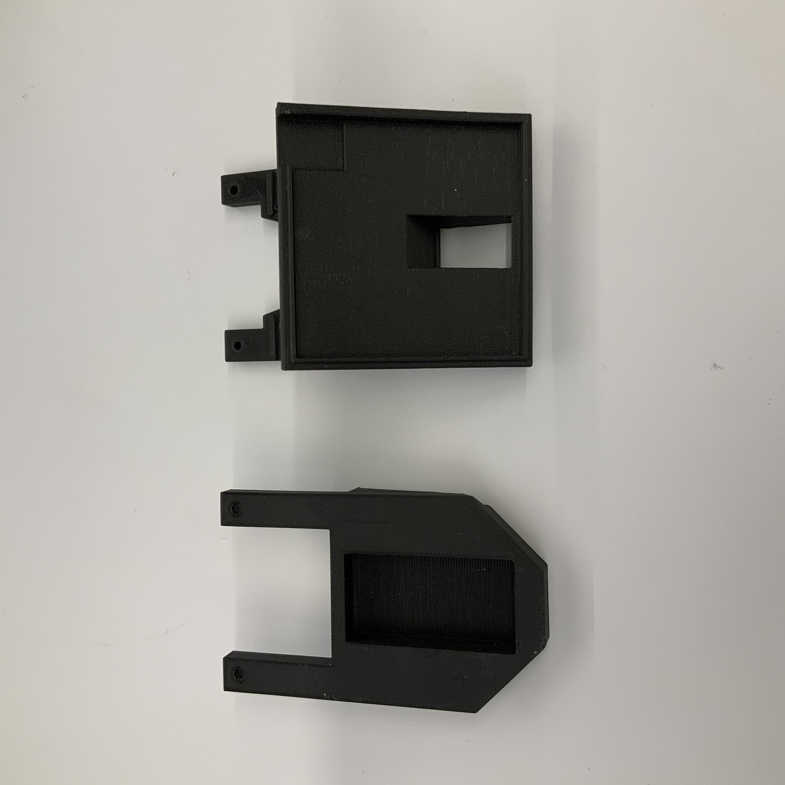

# Build_Instructions
Instructions for building the SLURP Gripper

{: .highlight }

## Required Parts

| Part      | Quantity | Purchase Link |
| ----------- | ----------- | ----------- |
| Arduino Nano Every    | 1 |https://www.amazon.com/Arduino-Nano-Every-Single-Board/dp/B07VX7MX27/ |
| Breadboard Jumper Wires | 1 Package | https://www.amazon.com/EDGELEC-Breadboard-1pin-1pin-Connector-Multicolored/dp/B07GD312VG |
| Wide Angle Reflector   | 1 | https://www.digikey.com/en/products/detail/carclo-technical-plastics/10170/2641626 |
| Quartz Tungsten Halogen Bulb | 1 | https://www.thorlabs.com/thorproduct.cfm?partnumber=QTH10B|
| SMA Bulkhead Adapter | 1 | https://www.thorlabs.com/thorproduct.cfm?partnumber=HASMA |
| SMA Fiber Adapter | 1 | https://www.thorlabs.com/thorproduct.cfm?partnumber=SM1SMA |
| Fiber Optic Cable | 1 | https://www.thorlabs.com/thorproduct.cfm?partnumber=M59L01 |
| Time of Flight Sensor | 1 | https://learn.adafruit.com/adafruit-vl53l4cd-time-of-flight-distance-sensor |
| SpectraPod OEM Board | 1 | https://www.mantispectra.com/the-spectrapod/ |
| C12880MA Micro-Spectrometer | 1 | https://groupgets.com/manufacturers/hamamatsu-photonics/products/c12880ma-micro-spectrometer |
| Teflon PTFE | 1 | https://www.mcmaster.com/8735K25/ |
| M2.5 Nuts | 1 Package | https://www.mcmaster.com/90370A202 |
| M2.5 Bolts | 1 Package | https://www.mcmaster.com/91292A010 |
| M1.6 Bolts | 1 Package | https://www.mcmaster.com/91292A263 |

## Assembly Instructions

1. Using the CAD files in the GitHub repo, print the gripper paddles. Onyx is recommended for rigidity.

