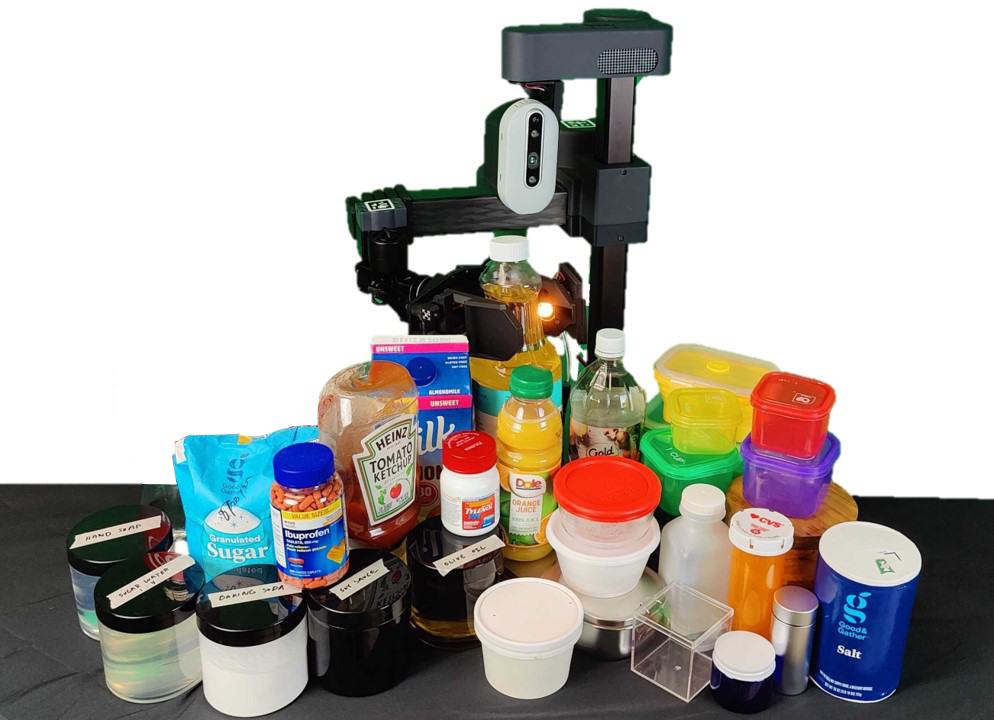

# SLURP!

### **S**pectroscopy of **L**iquids **U**sing **R**obot **P**re-Touch Sensing



A collaborative effort between the RIVeR lab @ Northeastern University and the RCHI Lab @ Carnegie Mellon University.

### TLDR;
For more detailed instruction, please see the associated [project website](#TODO) and [manuscript](https://arxiv.org/abs/2210.04941).

We welcome the use of this dataset and code in your work. If you do use our code/data, please include the following citation:
```
@misc{https://doi.org/10.48550/arxiv.2210.04941,
  doi = {10.48550/ARXIV.2210.04941},
  url = {https://arxiv.org/abs/2210.04941},
  author = {Hanson, Nathaniel and Lewis, Wesley and Puthuveetil, Kavya and Furline, Donelle and Padmanabha, Akhil and Padır, Taşkın and Erickson, Zackory},
  keywords = {Robotics (cs.RO), Signal Processing (eess.SP), FOS: Computer and information sciences, FOS: Computer and information sciences, FOS: Electrical engineering, electronic engineering, information engineering},
  title = {SLURP! Spectroscopy of Liquids Using Robot Pre-Touch Sensing},
  publisher = {arXiv},
  year = {2022},
  copyright = {Creative Commons Attribution 4.0 International}
}

```
Correspondence: hanson [.] n [@] northeastern [.] edu